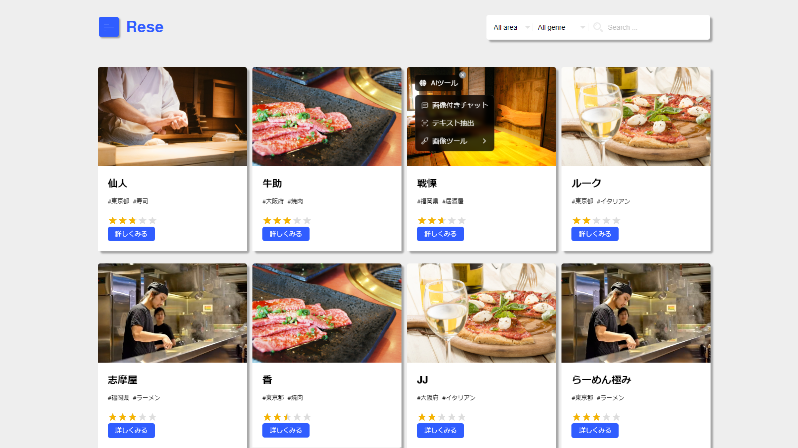
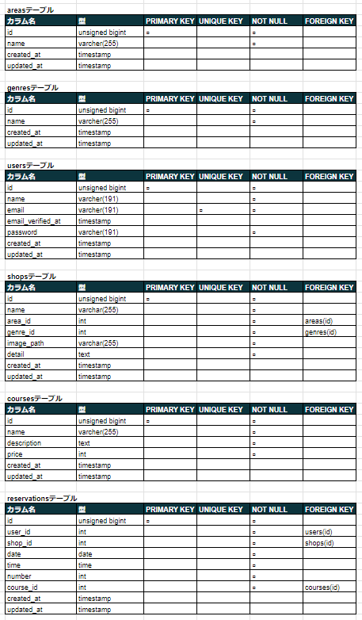
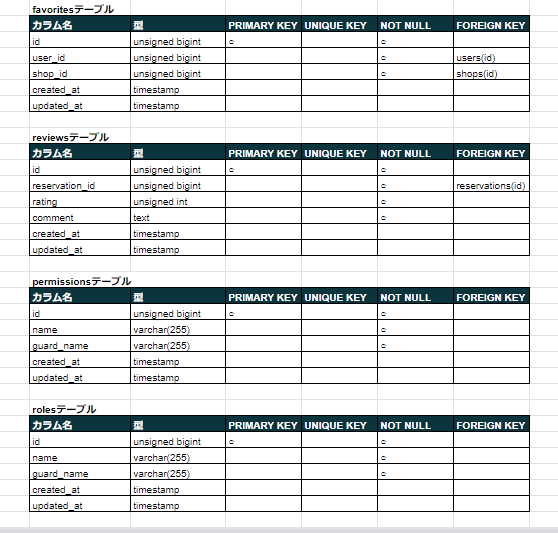
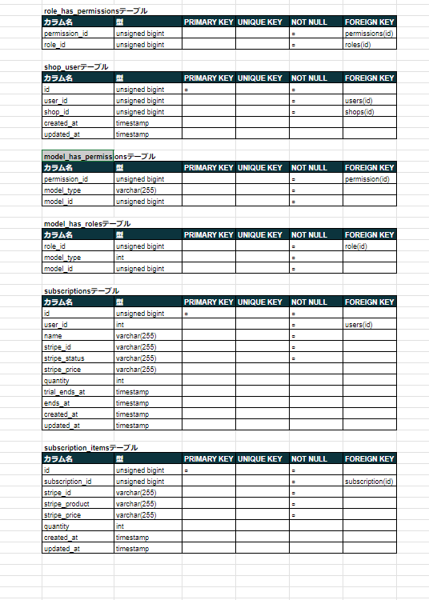

# Rese(飲食店予約サービス)
グループ会社の飲食店予約サービス


## 作成した目的
独自の予約サービスを持つため

## URL
 - 開発環境: 'http://localhost/'
 - phpMyAdmin: 'http://localhost:8080/'
 - mailhog: 'http://localhost:8025/'
 - 本番環境: http://54.65.6.224

## 機能一覧
 - 会員登録
 - ログイン
 - 店舗一覧表示
 - 店舗詳細表示
 - 飲食店予約
 - 会員マイページ表示
 - 飲食店予約変更
 - 飲食店予約削除
 - 利用者、予約後来店の店舗評価
 - 予約当日朝8:00に予約情報のリマインダーメール送信
 - 店舗でのQRコードによる予約情報の照合
 - 予約時、コース選択後の決済機能
 - 口コミ追加(1店舗につき1件)
 - ユーザー自身の口コミの編集
 - ユーザー自身の口コミ削除
 - 管理画面

### 管理画面
 - **管理者**
    - 店舗代表者の作成
    - 店舗代表者の削除
    - 登録者へのメール送信
    - ユーザーの口コミ削除(各店舗の口コミページから)
    - 新規店舗追加のCSVインポート
 - **店舗代表者**
    - 日付別予約情報の確認
    - 店舗情報の作成
    - 店舗情報の更新


## 使用技術(実行環境)
 - **バックエンド**
    - PHP 8.3.9
    - Laravel 8.83.27
 - **データベース**
    - MySQL 8.0.35
 - **Webサーバー**
    - Nginx
 - **メールサービス(開発環境)**
    - MailHog

## テーブル設計




## ER図


## 環境構築
**Dockerビルド**
1. `git clone git@github.com:tyswtpooh55/Rese.git`
2. DockerDesktopアプリを立ち上げる
3. `docker-compose up -d --build`

**Laravel環境構築**
1. `docker-compose exec php bash`
2. `composer install`
3. 環境変数ファイルの設定
    `cp .env.example .env`
4. .env に以下の環境変数を追加
    ```
    APP_NAME=Rese

    DB_CONNECTION=mysql
    DB_HOST=mysql
    DB_PORT=3306
    DB_DATABASE=laravel_db
    DB_USERNAME=laravel_user
    DB_PASSWORD=laravel_pass

    MAIL_FROM_ADDRESS=noreply@example.com

    STRIPE_SECRET_KEY=sk_test_51PQ7hED470QL7wqoUa6qAtLGj2T19OmonASJvuCEw9J8Dmq8ElHGpoIBHupOJNsYtooyZ2lZFJ011oVJWjrsr9Uf00qxw74uER
    STRIPE_PUBLISHABLE_KEY=pk_test_51PQ7hED470QL7wqo2dnssmgMZvMgnoy9pc2x6qMtMZOJ0NeZb6MKyiPE94cELQecfK4sJlmJo0kD7Ti2D5tYV12w00CXHwcSIN

    CASHIER_CURRENCY=JPY
    CASHIER_CURRENCY_LOCALE=ja_JP
    CASHIER_LOGGER=stack
    ```
5. アプリケーションキーの作成
    `php artisan key:generate`
6. マイグレーションの実行
    `php artisan migrate`
7. シーディングの実行
    `php artisan db:seed`
8. ストレージリンクの作成
    `php artisan storage:link`

## 開発環境
**ダミーデータ**
 - 管理者
    - UserName : `Admin`
    - Email : `admin@example.com`
    - password : `admin-pass`
 - 店舗責任者
    - UserName : `Manager1`
    - Email : `manager1@example.com`
    - password : `manager-pass`
 - 利用者
    - UserName : `Customer1`
    - Email : `customer1@example.com`
    - password : `pass1234`

## 本番環境
**登録済みアカウント**
 - 管理者
    - UserName : `Admin`
    - Email : `admin@example.com`
    - password : `admin-pass`
 - 店舗責任者
    - UserName : `Manager1`
    - Email : `manager1@example.com`
    - password : `manager-pass`
 - 利用者
    - UserName : `Customer1`
    - Email : `customer1@example.com`
    - password : `pass1234`

 - 新規登録の場合、`wtp_55_tmym@yahoo.ne.jp`からのメール受信あり。メールアドレス認証後、Mypageアクセス、予約登録等可能

### 決済機能
 - テストカード(Stripeによるテストカード)
    - 番号 : `3566002020360505` (JCB)
    - 日付 : 任意の将来の日付
    - セキュリティコード : 任意の3桁の番号

## CSVファイル記述方法
**ファイル形式**
- 拡張子: .csv

**ヘッダー行**
- 1行目にヘッダーを記述
- ヘッダー名
  - `店舗名`, `地域`, `ジャンル`, `画像URL`, `店舗概要`
  - `Shop Name`, `Area`, `Genre`, `Image URL`, `Detail`  など

**データ形式**
- 店舗名: 入力必須、文字列、50文字以内
- 地域: 入力必須、文字列、「東京都」「大阪府」「福岡県」のいずれか
- ジャンル: 入力必須、文字列、「寿司」「焼肉」「イタリアン」「居酒屋」「ラーメン」のいずれか
- 画像URL: 入力必須、文字列、拡張子`jpeg`,`png`のみ
- 店舗概要: 入力必須、文字列、400文字以内

**サンプル**
```
店舗名,地域,ジャンル,画像URL,店舗概要
仙人,東京都,寿司,sushi.jpg,料理長厳選の食材から作る寿司を用いたコースをぜひお楽しみください。食材・味・価格、お客様の満足度を徹底的に追求したお店です。特別な日のお食事、ビジネス接待まで気軽に使用することができます。
牛助,大阪府,焼肉,yakiniku.jpg,焼肉業界で20年間経験を積み、肉を熟知したマスターによる実力派焼肉店。長年の実績とお付き合いをもとに、なかなか食べられない希少部位も仕入れております。また、ゆったりとくつろげる空間はお仕事終わりの一杯や女子会にぴったりです。
```


